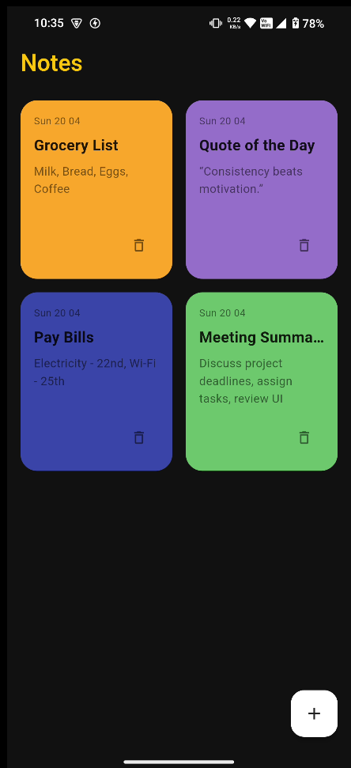
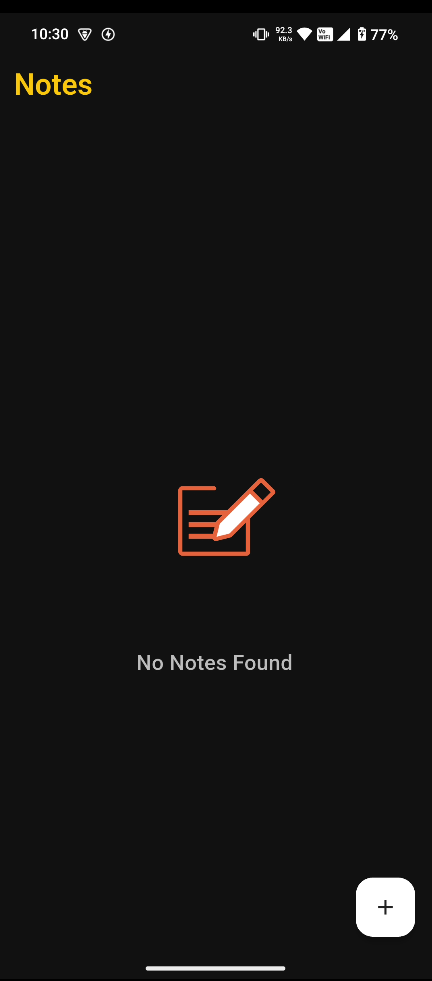

# 📝 Notes App

A beautiful and minimal **Flutter Notes App** to jot down your thoughts, todos, and reminders.  
This app supports adding, editing, deleting notes — all with a smooth UI and persistent local storage.

---

## 📸 Screenshots

| Home Screen | Create Note |
|-------------|-------------|
|  |  |


---

## 🚀 Features

- 🧠 Create, edit, and delete notes
- 💡 Light & dark theme toggle
- 💾 Local data storage using `shared_preferences` or `SQLite`
- 🎨 Clean & customizable UI
- 📦 State management using custom `InheritedWidget` for efficient data sharing

---

## 🛠️ Tech Stack

- **Flutter** 🐦
- **Dart**
- **lottie**
- **SQLite**
- **InheritedWidget** for state propagation

---

## 🧪 Getting Started

1. Clone this repo:
   ```bash
   git clone https://github.com/YOUR_USERNAME/notes_app.git
   ```

2. Navigate into project:
   ```bash
   cd notes_app
   ```

3. Install dependencies:
   ```bash
   flutter pub get
   ```

4. Run it on device:
   ```bash
   flutter run
   ```

---

## 📂 Folder Structure 

```bash
lib/
├── main.dart
├── models/
├── screens/
├── widgets/
└── services/
```

---

## ⚙️ Architecture

- Utilizes a minimal but effective architecture suitable for small to mid-size apps
- Note data is shared from the root widget using a custom `InheritedWidget`, allowing efficient UI updates without over-rebuilding
- Clean separation between UI, data model, and storage logic

---

## 📄 License

This project is licensed under the MIT License.

---

## ✨ Author

Made with ❤️ by [Shourya](https://github.com/shourya13x)
